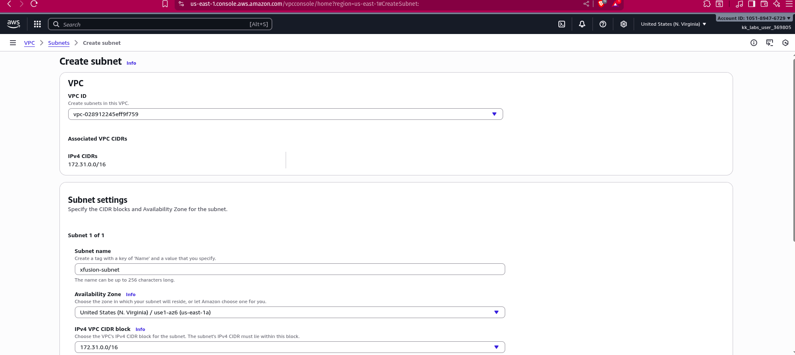
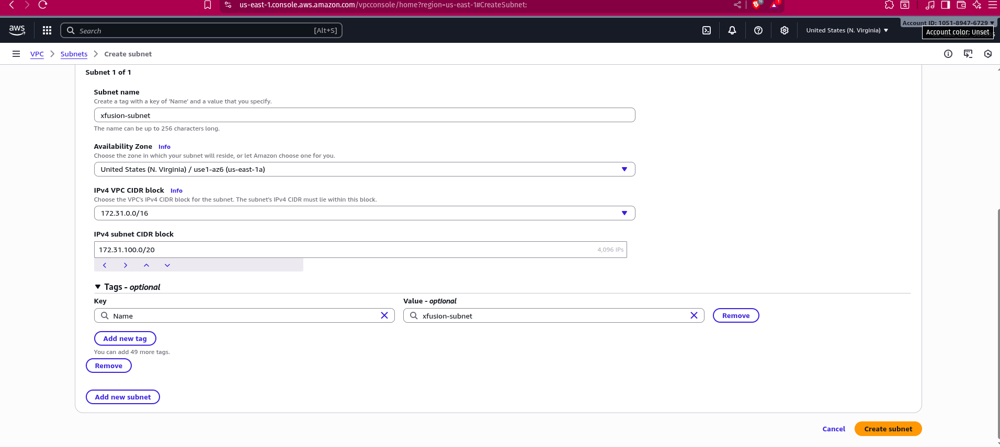
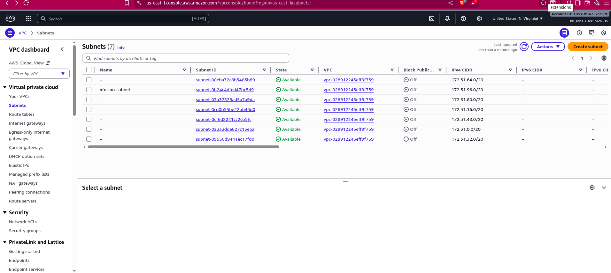

The Nautilus DevOps team is strategizing the migration of a portion of their infrastructure to the AWS cloud. Recognizing the scale of this undertaking, they have opted to approach the migration in incremental steps rather than as a single massive transition.

For this task, create one subnet named xfusion-subnet under default VPC.

Theory: Subnet Calculation (CIDR): I will explain how CIDR notation works (e.g., /24 vs /20) and how to calculate the total number of available IP addresses in a subnet block. This is a critical skill for network design.

Theory: The 5 Reserved IPs: Did you know that you cannot use every single IP address in your AWS subnet? I will explain which 5 IP addresses AWS reserves in every subnet and why they are unavailable for your instances.

Lab: Create a Subnet: Finally, we will go into the AWS console and create a new subnet within our VPC, applying the knowledge we just learned.

