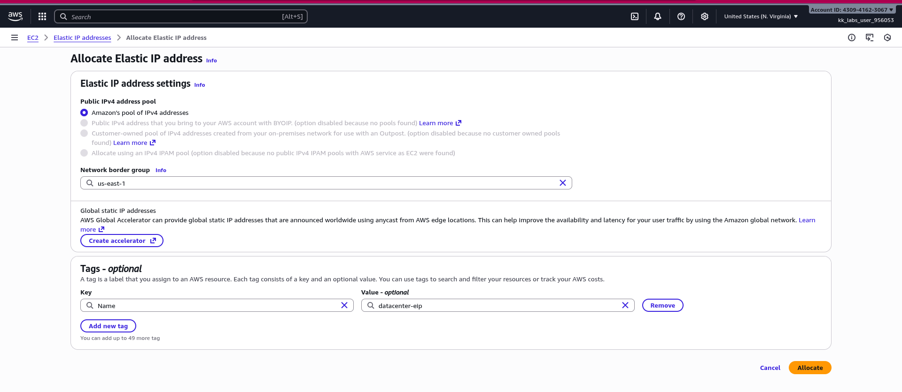
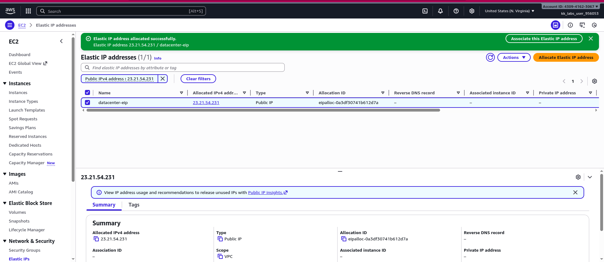
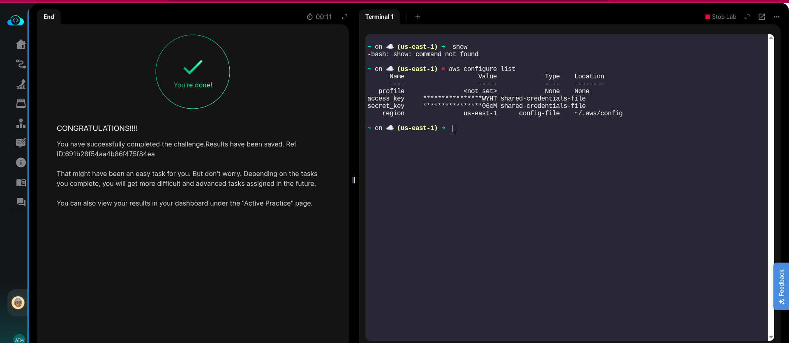

The Nautilus DevOps team is strategizing the migration of a portion of their infrastructure to the AWS cloud. Recognizing the scale of this undertaking, they have opted to approach the migration in incremental steps rather than as a single massive transition. To achieve this, they have segmented large tasks into smaller, more manageable units. This granular approach enables the team to execute the migration in gradual phases, ensuring smoother implementation and minimizing disruption to ongoing operations. By breaking down the migration into smaller tasks, the Nautilus DevOps team can systematically progress through each stage, allowing for better control, risk mitigation, and optimization of resources throughout the migration process.

For this task, allocate an Elastic IP address, name it as datacenter-eip.

An Elastic IP address is a static IPv4 address designed for dynamic cloud computing. An Elastic IP address is allocated to your AWS account, and is yours until you release it.

### Solution:

- An Elastic IP address is static; it does not change over time.
- An Elastic IP address is for use in a specific Region only, and cannot be moved to a different Region.

- An Elastic IP address comes from Amazon's pool of IPv4 addresses, or from a custom IPv4 address pool that you have brought to your AWS account. There is no support of Elastic IP addresses for IPv6.

- To use an Elastic IP address, you first allocate one to your account, and then associate it with your instance or a network interface.

>[!Note]
> When you associate an Elastic IP address with an instance, it is also associated with the instance's primary network interface. When you associate an Elastic IP address with a network interface that is attached to an instance, it is also associated with the instance.

## Allocating Elastic IP for given task:

