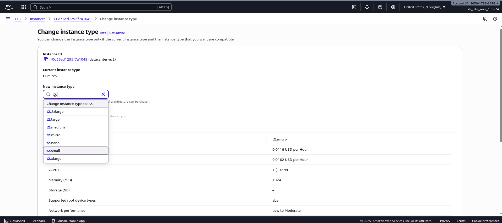
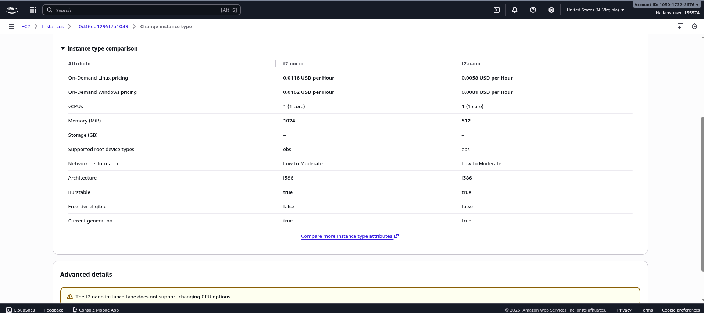
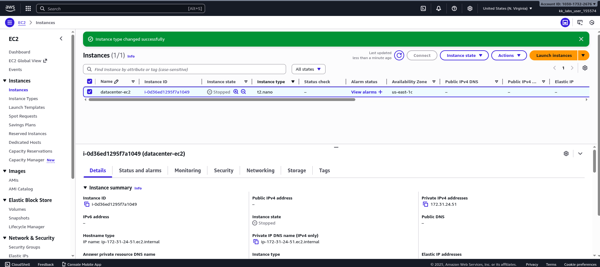
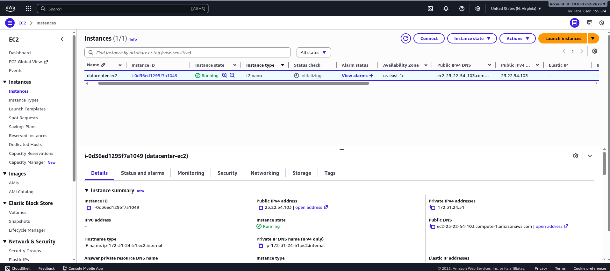

During the migration process, the Nautilus DevOps team created several EC2 instances in different regions. They are currently in the process of identifying the correct resources and utilization and are making continuous changes to ensure optimal resource utilization. Recently, they discovered that one of the EC2 instances was underutilized, prompting them to decide to change the instance type. Please make sure the Status check is completed (if its still in Initializing state) before making any changes to the instance.

1) Change the instance type from t2.micro to t2.nano for datacenter-ec2 instance.

2) Make sure the ec2 instance datacenter-ec2 is in running state after the change.

## SOLUTION

To change the instance type of our ec2, Stop the instance before making the change.

>[!Note]
>You cannot change the type of a Spot Instance.

