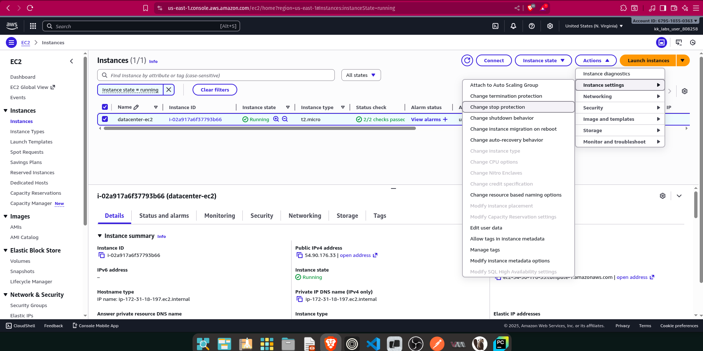
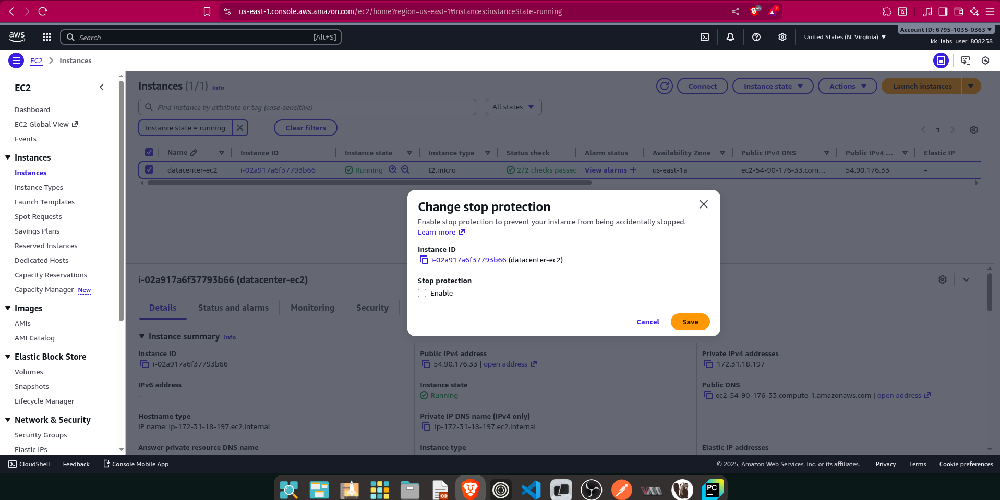

As part of the migration, there were some components added to the AWS account. Team created one of the EC2 instances where they need to make some changes now.

There is an EC2 instance named datacenter-ec2 under us-east-1 region, enable the stop protection for this instance.


===> **Stop protection** is a feature in Amazon EC2 that prevents an instance from being accidentally stopped or terminated through the AWS Management Console, AWS CLI, or API calls

## SOLUTION:

- Open the Amazon EC2 console:
- Choose Instances.
- Select the instance, and then choose Actions>Instance settings>Change stop protection.
- Select the Enable checkbox, and then choose Save.




### AWS CLI

```bash
aws ec2 modify-instance-attribute \
    --instance-id i-02a917a6f37793b66 \
    --disable-api-stop
```