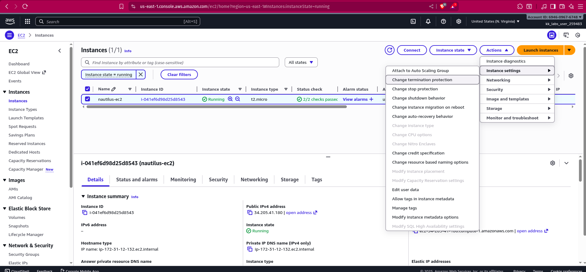
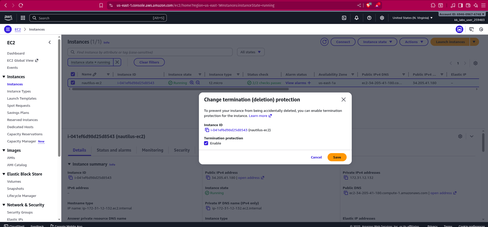
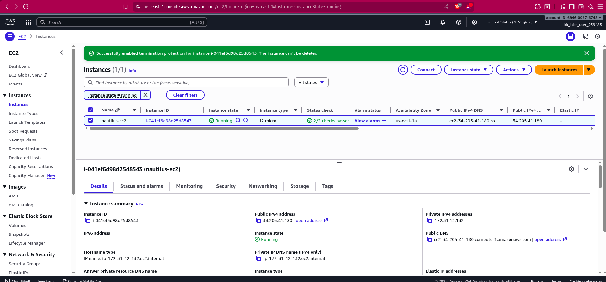

As part of the migration, there were some components created under the AWS account. The Nautilus DevOps team created one EC2 instance where they forgot to enable the termination protection which is needed for this instance.

An instance named nautilus-ec2 already exists in us-east-1 region. Enable termination protection for the same.

## SOLUTION
Termination protection in AWS is a feature designed to prevent Amazon EC2 instances from being accidentally terminated

### Using the AWS Console:

- Select the instance in the EC2 console.
- Choose Actions, then Instance settings, and  select Change termination protection.
- Select Enable to activate protection.

```bash
aws ec2 modify-instance-attribute --instance-id i-1234567890abcdef0 --disable-api-termination   
```

## SNAPSHOTS



